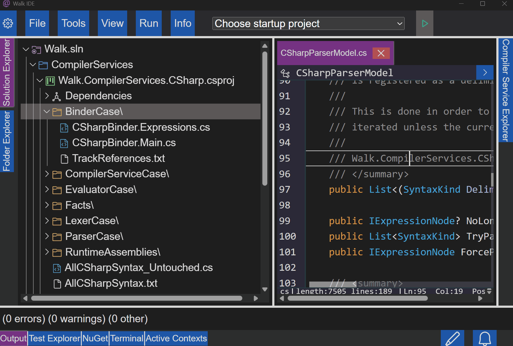
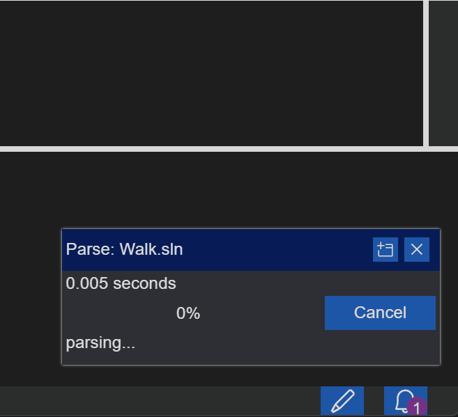

# Clair Ide

From the age of 24 to 27, I spent 3 years making an IDE. This repo contains the final result now that I'm moving on from this. There's still more that can be done, and I've described such things in [my youtube channel's community posts](https://www.youtube.com/@hunterfreeman3496/posts).

See [my youtube channel](https://www.youtube.com/@hunterfreeman3496) for 3 years of videos.

> The most recent video I've posted "Luthetus IDE 2025" does not showcase the IDE with this finalized source code. The video is quite a few months old by this point

## Installation:
[INSTALLATION.md](./INSTALLATION.md)

## Demo:

https://anxietyandscreaming.github.io/anxietyandscreaming/

> The demo is an extremely barebones version of the native application.

> It essentially only can open the one C# file that was made specifically for the demo. The file is quite large though, so this showcases the performance of the text editor.

> Most types in the demo file don't reference properly because the types just don't exist. Natively, type references that are defined within the same solution tend to work, short of an unsupported C# syntax causing the solution wide parse to throw a caught exception.

> `Console.WriteLine()`... I never made it to this but I believe these are "reference assemblies". All in all, no code that exists outside your chosen solution will reference properly.

## Introduction:

- A free and open source IDE
- Runs on Linux, Windows, and Mac
- Written with the .NET environment: C#, [Blazor UI Framework](https://dotnet.microsoft.com/en-us/apps/aspnet/web-apps/blazor), and a [lightweight Photino webview](https://github.com/tryphotino/photino.Blazor).

The IDE can support any programming language by way of the 'ICompilerService' interface by forking the source code and writing the respective 'ICompilerService' interface implementation.

Edit files:

Solution wide parse:

